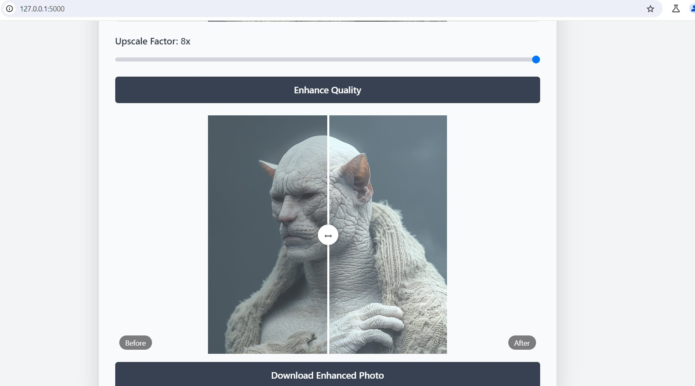

# PixUP-Upscale

PixUP-Upscale is a web application that enhances the quality of images using advanced upscaling techniques. Built on the Python Flask framework, this application provides a user-friendly interface for image upscaling with various customization options.



## Features

- Upload and preview images before processing
- Multiple upscale factors: 2x, 4x, 6x, 8x
- Image quality enhancement simulation
- Interactive before/after comparison slider
- Progress bar for visual feedback during processing
- Download enhanced images
- Multi-language support (Turkish, English, German, Russian)
- Dark/Light mode toggle
- Responsive design for various devices

## Installation

Follow these steps to run the project on your local machine:

1. Clone the repository:
   ```
   git clone https://github.com/U-C4N/PixUP-Upscale.git
   cd PixUP-Upscale
   ```

2. Create and activate a virtual Python environment:
   ```
   python -m venv venv
   source venv/bin/activate  # For Windows: venv\Scripts\activate
   ```

3. Install the required packages:
   ```
   pip install -r requirements.txt
   ```

4. Run the application:
   ```
   python app.py
   ```

5. Open your browser and go to `http://127.0.0.1:5000/` to start using the application.

## Usage

1. On the main page, click the "Select Photo" button to upload an image.
2. Use the slider to select the desired upscale factor (2x, 4x, 6x, or 8x).
3. Click the "Enhance Quality" button to start the upscaling process.
4. Once processing is complete, use the comparison slider to view the differences between the original and enhanced images.
5. Click the "Download Enhanced Photo" button to save the improved image.
6. Use the language selector to change the interface language.
7. Toggle between dark and light modes using the theme switch in the top-right corner.

## Acknowledgments

- [Flask](https://flask.palletsprojects.com/) - Web framework
- [TailwindCSS](https://tailwindcss.com/) - CSS framework for styling
- [JavaScript](https://developer.mozilla.org/en-US/docs/Web/JavaScript) - For interactive features

## License

This project is licensed under the MIT License - see the [LICENSE](LICENSE) file for details.

## Contact

U-C4N - [GitHub Profile](https://github.com/U-C4N)

Project Link: [https://github.com/U-C4N/PixUP-Upscale](https://github.com/U-C4N/PixUP-Upscale)
